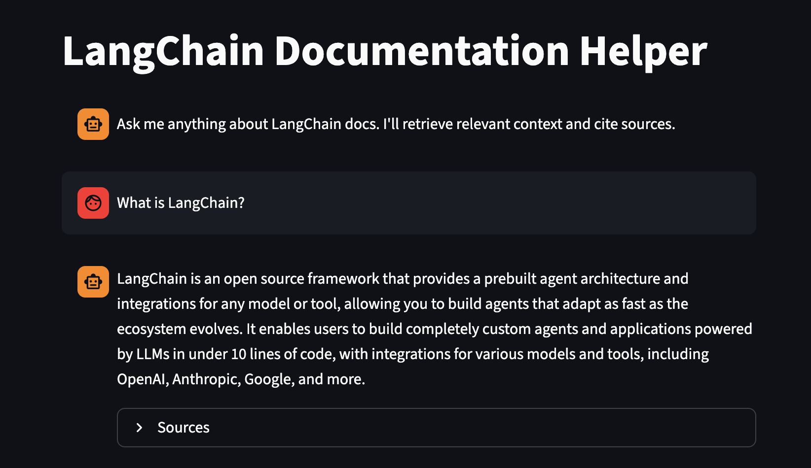
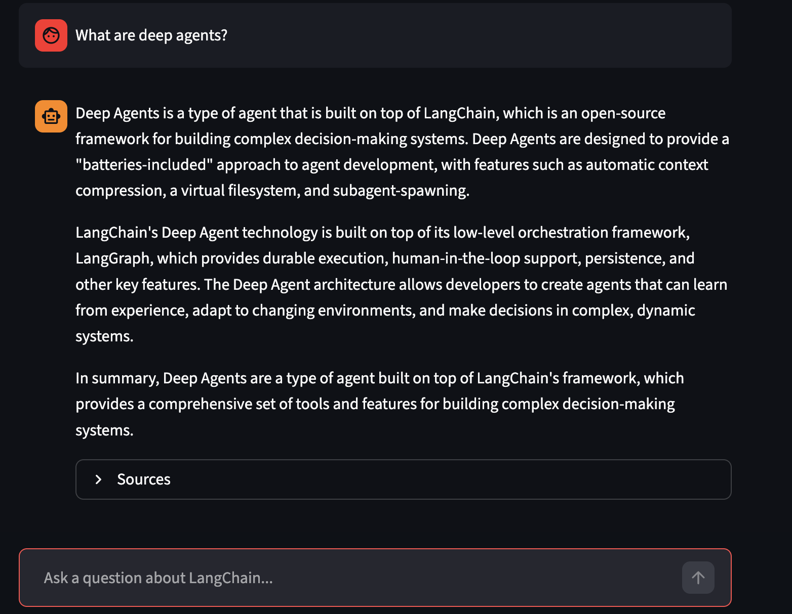
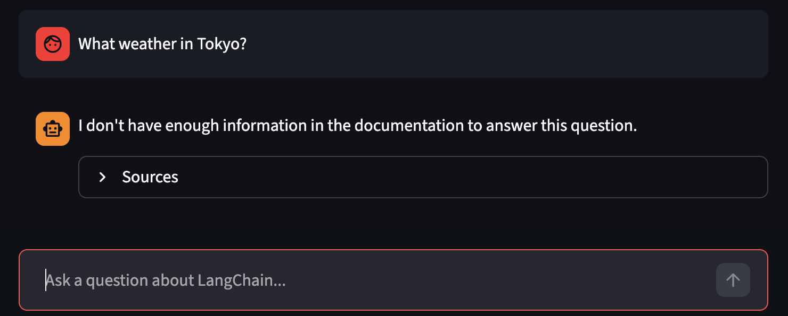

# doc-helper

A local RAG-based assistant that answers questions about LangChain documentation. Ask anything about LangChain — the system finds relevant docs and generates an answer using a local LLM.

## Screenshots

**What is LangChain?**


**What are deep agents?**


**What weather in Tokyo?** *(out-of-scope question — correctly says it doesn't know)*


## Stack

- **LangChain** — orchestration
- **Tavily** — documentation crawling
- **OpenSearch** — vector store
- **Ollama** — local LLM and embeddings (runs natively, not in Docker)
- **Streamlit** — chat UI
- **Docker** — containerized services (OpenSearch + app)

## Architecture

```
User question
    → embed with Ollama (nomic-embed-text)
    → search OpenSearch for relevant chunks
    → pass chunks + question to Ollama LLM
    → stream answer to Streamlit UI
```

## Requirements

- Docker
- [Ollama](https://ollama.com) installed natively (required for GPU acceleration)
- Tavily API key — free at https://app.tavily.com
- LangSmith API key — free at https://smith.langchain.com

## Setup

1. Clone the repo and create `.env` from `.env.example`:

```bash
cp .env.example .env
```

2. Fill in the API keys in `.env`.

3. Pull the required Ollama models:

```bash
ollama pull nomic-embed-text
ollama pull llama3.2:3b
```

4. Build and start the services:

```bash
make build && make up
```

5. Run ingestion to crawl and index LangChain docs:

```bash
make ingest
```

6. Open the app at http://localhost:8501

## Makefile commands

| Command | Description |
|---|---|
| `make build` | Build the app Docker image |
| `make up` | Start all services |
| `make down` | Stop all services |
| `make ingest` | Crawl and index LangChain docs |
| `make restart` | Restart the app container |
| `make logs` | Follow logs |
| `make clean` | Stop services and remove volumes |
| `make nuke` | Remove everything including Docker images |

## Configuration

All configuration is done via `.env`:

| Variable | Description |
|---|---|
| `TAVILY_API_KEY` | Tavily API key |
| `LANGCHAIN_API_KEY` | LangSmith API key |
| `LANGCHAIN_PROJECT` | LangSmith project name |
| `OPENSEARCH_URL` | OpenSearch connection URL |
| `OPENSEARCH_INDEX_NAME` | Name of the vector index |
| `OLLAMA_BASE_URL` | Ollama server URL |
| `LLM_MODEL` | Model used for answer generation |
| `EMBED_MODEL` | Model used for embeddings |